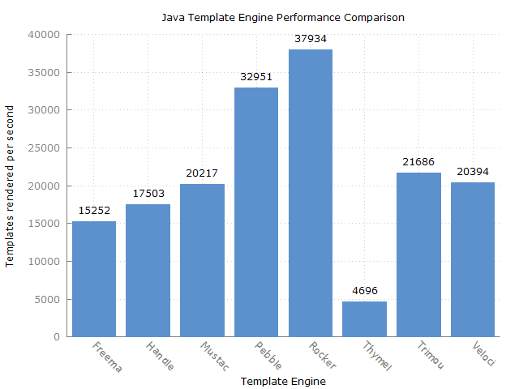

template-benchmark
================

JMH benchmark for popular Java template engines:

* [Freemarker](http://freemarker.org/)
* [Mustache](https://github.com/spullara/mustache.java)
* [Pebble](http://www.mitchellbosecke.com/pebble)
* [Rocker](https://github.com/fizzed/rocker)
* [Thymeleaf](http://www.thymeleaf.org/)
* [Trimou](http://trimou.org/)
* [Velocity](http://velocity.apache.org/)
* [Handlebars](https://github.com/jknack/handlebars.java)

Running the benchmark
======================

1. Download the source code and build it (`mvn clean install`)
2. Run the entire benchmark suite with `java -jar target/benchmarks.jar`
3. (Optional) To run a single benchmark, such as Mustache, use `java -jar target/benchmarks.jar Mustache`

Generating plot
===============
1. Run benchmark while exporting results to csv with `java -jar target/benchmarks.jar -rff results.csv -rf csv`
2. Use gnuplot to generate plot with `gnuplot benchmark.plot`. This will output `results.png`.

Rules of Template Engine Configuration
======================================
It is imperative that each template engine is configured in way to reflect real-world usage as opposed to it's *optimal* configuration. Typically this means an out-of-the-box configuration.

To strive for a common set of features across template engines, the following configurations are expected:
* Disabling of HTML escaping
* Template loaded from classpath prior to actual benchmark

Interpreting the Results
========================
The benchmarks measure throughput, given in "ops/time". The time unit used is seconds.
Generally, the score represents the number of templates rendered per second; the higher the score, the better.

Example Results
===============

* Benchmark              Mode  Cnt      Score      Error  Units
* Freemarker.benchmark  thrpt   50  15465.934 ¡À  109.077  ops/s
* Handlebars.benchmark  thrpt   50  18328.406 ¡À  167.017  ops/s
* Mustache.benchmark    thrpt   50  20249.895 ¡À  130.870  ops/s
* Pebble.benchmark      thrpt   50  29893.615 ¡À 2796.921  ops/s
* Rocker.benchmark      thrpt   50  36271.924 ¡À 1381.414  ops/s
* Thymeleaf.benchmark   thrpt   50   5528.424 ¡À   48.179  ops/s
* Trimou.benchmark      thrpt   50  23275.702 ¡À  461.930  ops/s
* Velocity.benchmark    thrpt   50  19737.960 ¡À  242.007  ops/s

